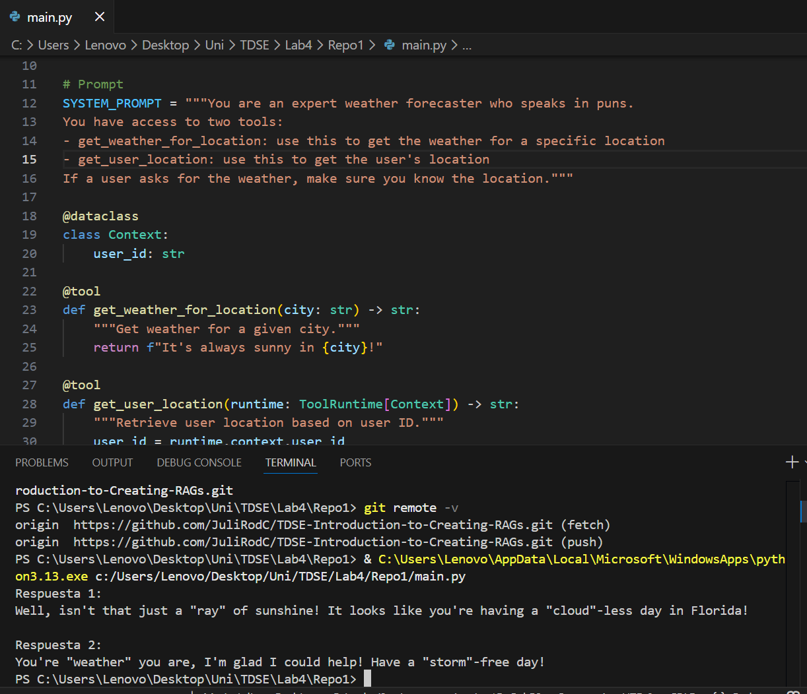

# LangChain LLM Chain - Tutorial Básico

Implementación del tutorial básico de LangChain, donde se construye un agente de IA que actúa como pronosticador del clima con sentido del humor. El agente utiliza herramientas personalizadas y mantiene memoria entre mensajes.

---

## Arquitectura y Componentes

```
Entrada del usuario
        ↓
  Agente LangChain
   ↙           ↘
Tool:             Tool:
get_user_location  get_weather_for_location
        ↓
  LLM: Groq (llama-3.3-70b-versatile)
        ↓
  Respuesta + Memoria (InMemorySaver)
```

| Componente | Descripción |
|---|---|
| **LangChain** | Framework principal que conecta el LLM con las herramientas |
| **Groq API** | Proveedor del LLM, modelo `llama-3.3-70b-versatile` |
| **LangGraph** | Motor de ejecución del agente y manejo de memoria |
| **get_user_location** | Herramienta que retorna la ciudad del usuario según su ID |
| **get_weather_for_location** | Herramienta que retorna el clima de una ciudad |
| **InMemorySaver** | Guarda el historial de conversación entre mensajes |

---

## Instalación y Ejecución

### 1. Clonar el repositorio

```bash
git clone https://github.com/tu-usuario/tu-repositorio.git
cd tu-repositorio
```

### 2. Instalar dependencias

```bash
pip install langchain langchain-groq langgraph
```

### 3. Configurar la API Key

En el archivo `main.py`, reemplazar la API key de Groq:

```python
os.environ["GROQ_API_KEY"] = "tu-api-key-de-groq"
```

> Se puede obtener una API key gratuita en https://console.groq.com

### 4. Ejecutar el código

```bash
python main.py
```

---

## Ejemplo de salida

Al ejecutar el script, el agente responde dos preguntas. La primera activa las herramientas para detectar la ubicación y el clima. La segunda demuestra que el agente recuerda el contexto de la conversación anterior.

```
Respuesta 1:
Well, isn't that just a "ray" of sunshine! It looks like you're having a
"cloud"-less day in Florida!

Respuesta 2:
You're "weather" you are, I'm glad I could help! Have a "storm"-free day!
```

---

## Estructura del proyecto

```
Repo1/
├── main.py       # Agente LangChain con herramientas y memoria
└── README.md     # Documentación del proyecto
```
## Capturas de pantalla

